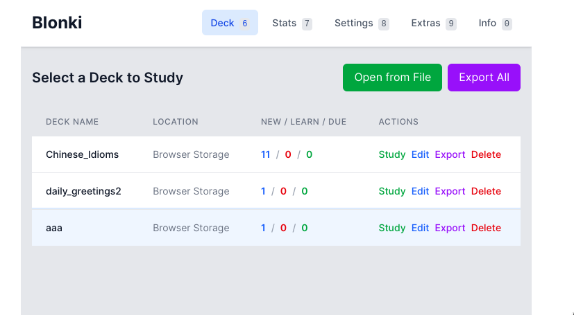

# Blonki - Web-based Anki Client

A single-page application for spaced repetition learning, built with Svelte 5 and TypeScript.

Features

- support for reviewing/editing Anki .apkg files
- uses Filesystem Access API to update decks files directly on host filesystem
- automatic generation of decks from YouTube transcripts (e.g. via self-hosted Ollama, OpenAI key, etc)

